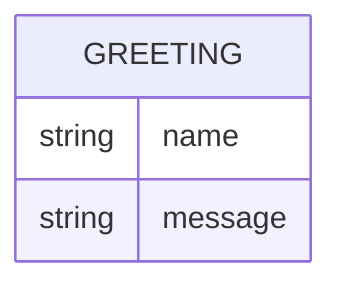

# Domain Model

Greeter is stateless and persists nothing; the diagram below models the
single request/response shape the API exchanges, not stored data.

`GREETING` is the shape returned by `GET /hello` — `name` is the (optional)
caller-supplied name, and `message` is the generated greeting text. No
instance of it is ever stored.